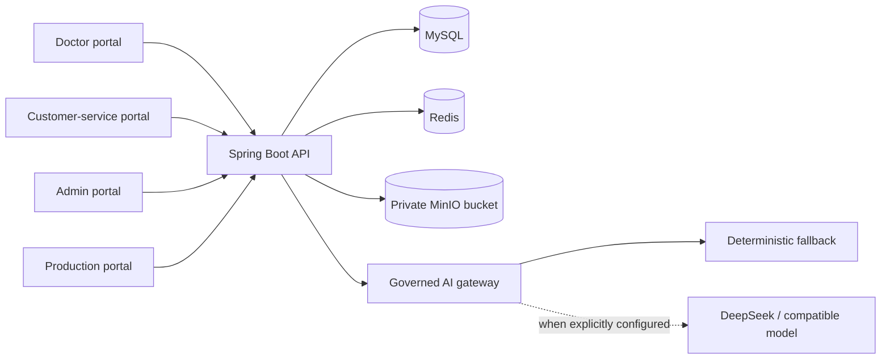
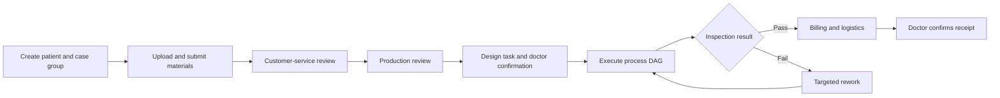

# Architecture

The frontend is one Vue SPA with four portal entry modes. The backend is best
described as a modular monolith: Maven declares domain modules, while most
runtime business implementation currently lives in `platform-server` and uses
a limited incremental bridge to a pinned RuoYi-Vue-Pro subset. This archive
does not contain or claim a full RuoYi runtime integration.

## Main business sequence

## Key code areas

- Portal assembly: `frontend/src/App.vue`
- Doctor case-group flow: `frontend/src/doctor/DoctorCaseGroupWizard.vue`
- Authentication and portal mapping: `backend/platform-server/.../bootstrap/`
- Case-group and order creation: `backend/platform-server/.../order/`
- Workflow runtime and execution: `backend/platform-server/.../workflow/`
- Design lifecycle: `backend/platform-server/.../design/`
- File governance: `backend/platform-server/.../file/`
- Billing/logistics and messages: `backend/platform-server/.../collaboration/`
- AI gateway: `backend/platform-server/.../ai/`
